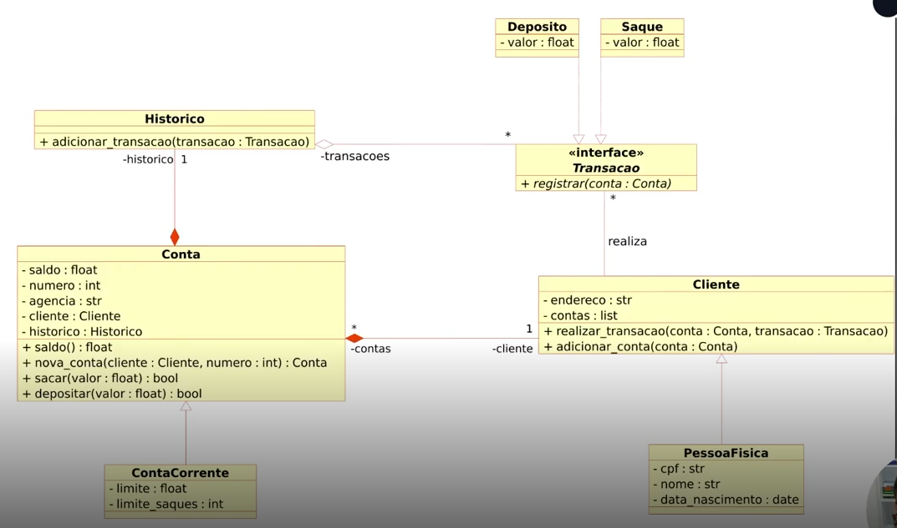

# Modelando o Sistema Bancário em POO com Python - DIO

Modelando o Sitema Bancário do repositório [Otimizando-Sistema-Bancario-com-Python](https://github.com/davidsmaia/Otimizando-Sistema-Bancario-com-Funcoes-Python) utilizando Programação Orientada a Objetos.

O objetivo do desafio é atualizar a implementação do sistema bancário, para armazenar os dados de clientes e contas bancárias em objetos ao invés de dicionários. O código foi criado seguindo o Modelo de Classes UML apresentado pela DIO
 

[Resolução proposta pela DIO](https://github.com/davidsmaia/trilha-python-dio/tree/main/02%20-%20Programa%C3%A7%C3%A3o%20Orientada%20a%20Objetos/10%20-%20desafio)
